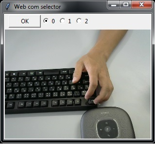

接続されている複数のwebcameを検索・提示して，ひとつを選択するためのダイアログを表示するプログラムです.  
tkinter, Pillow, opencvを利用しています．動作確認は python 3.8, opencv-python, Pillow, pycharm環境で行なっています.  

tkinterをメインで利用しているコードからこのコードを利用することはできません．

This program searches multiple  webcams connected to the pc and
displays a dialog to select one.
It uses tkinter, Pillow and opencv.  
It has been tested with python 3.8 with opencv-python and Pillow environment.

useage:
    idx = select_webcam_idx()  

note:
  this is not available if your program uses tkinter.

sample (3 webcams are available)  
  
